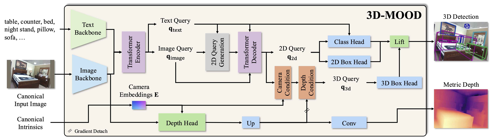

<div align="center">

# 3D-MOOD: Lifting 2D to 3D for Monocular Open-Set Object Detection

<a href="https://arxiv.org/abs/2507.23567"></a>
<a href='https://royyang0714.github.io/3D-MOOD'></a>

</div>

<div>
  
</div>

<div>
  <p></p>
</div>

> [**3D-MOOD: Lifting 2D to 3D for Monocular Open-Set Object Detection**](https://royyang0714.github.io/3D-MOOD) \
> Yung-Hsu Yang, Luigi Piccinelli, Mattia Segu, Siyuan Li, Rui Huang, Yuqian Fu, Marc Pollefeys, Hermann Blum, Zuria Bauer \
> ICCV 2025,
> *Paper at [arXiv 2507.23567](https://arxiv.org/pdf/2507.23567.pdf)*


## News and ToDo

- [x] `25.08.2025`: Release code and models.
- [x] `25.06.2025`: 3D-MOOD is accepted at ICCV 2025!

## Getting Started

We use [Vis4D](https://github.com/SysCV/vis4d) as the framework to implement 3D-MOOD.
Please check the [document](https://vis4d.readthedocs.io) for more details.

### Installation

We support Python 3.11+ and PyTorch 2.4.0+.
Please install the correct PyTorch version according to your own hardware settings.

```bash
conda create -n opendet3d python=3.11 -y

conda activate opendet3d

# Install Vis4D
# It should also install the PyTorch with CUDA support. But please check.
pip install vis4d==1.0.0

# Install CUDA ops
pip install git+https://github.com/SysCV/vis4d_cuda_ops.git

# Install 3D-MOOD
pip install -v -e .
```

### Data Preparation

We provide the HDF5 files and annotations [here](https://huggingface.co/datasets/RoyYang0714/3D-MOOD) for ScanNet v2, Argoverse 2, and the depth GT for Omni3D datasets.

For training and testing with [OmniD](https://github.com/facebookresearch/omni3d/blob/main/DATA.md), please refer to [DATA](./docs/DATA.md) to setup the Omni3D data.

We also illustrate the coordinate system we use [here](./docs/COORDINATE.md).

The final data folder should be like:

```bash
REPO_ROOT
├── data
│   ├── omni3d
│   │   └── annotations
│   ├── KITTI_object
│   ├── KITTI_object_depth
│   ├── nuscenes
│   ├── nuscenes_depth
│   ├── objectron
│   ├── objectron_depth
│   ├── SUNRGBD
│   ├── ARKitScenes
│   ├── ARKitScenes_depth
│   ├── hypersim
│   ├── hypersim_depth
│   ├── argoverse2
│   │   ├── annotations
│   │   └── val.hdf5
│   └── scannet
│       ├── annotations
│       └── val.hdf5
```

By default in our provided config we use `HDF5` as the data backend.
You can convert each folder using the [script](https://github.com/SysCV/vis4d/blob/main/vis4d/data/io/to_hdf5.py) to generate them.
Or you can just change the `data_backend` in the configs to `FileBackend`.

### Model Zoo

Note that the score of Argoverse 2 and ScanNet is the proposed open detection score (**ODS**) and the score for Omni3D test set is AP.

| Model | Config | KITTI | nuScenes | SUNRGBD | Hypersim | ARKitScenes | Objectron | **Omni3D** | **Argoverse 2** | **ScanNet** |
|:-----:|:------:|:-----:|:--------:|:-------:|:--------:|:-----------:|:---------:|:------:|:---------------:|:-----------:|
| [Swin-T](https://huggingface.co/RoyYang0714/3D-MOOD/resolve/main/gdino3d_swin-t_120e_omni3d_699f69.pt) | [config](./opendet3d/zoo/gdino3d/gdino3d_swin_t_omni3d.py) | 32.8 | 31.5 | 21.9 | 10.5 | 51.0 | 64.3 | 28.4 | 22.4 | 30.2 |
| [Swin-B](https://huggingface.co/RoyYang0714/3D-MOOD/resolve/main/gdino3d_swin-b_120e_omni3d_834c97.pt) | [config](./opendet3d/zoo/gdino3d/gdino3d_swin_b_omni3d.py) | 31.4 | 35.8 | 23.8 |  9.1 | 53.9 | 67.9 | 30.0 | 23.8 | 31.5 |

### Testing

```bash
# Swin-T
vis4d test --config opendet3d/zoo/gdino3d/gdino3d_swin_t_omni3d.py --gpus 1 ---ckpt https://huggingface.co/RoyYang0714/3D-MOOD/resolve/main/gdino3d_swin-t_120e_omni3d_699f69.pt

# Swin-B 
vis4d test --config opendet3d/zoo/gdino3d/gdino3d_swin_b_omni3d.py --gpus 1 --ckpt https://huggingface.co/RoyYang0714/3D-MOOD/resolve/main/gdino3d_swin-b_120e_omni3d_834c97.pt
```

### Training

We use batch size of `128` to train our models.
The setting is assumed running on the cluster using RTX 4090.

```bash
# Swin-T
vis4d fit --config opendet3d/zoo/gdino3d/gdino3d_swin_t_omni3d.py --gpus 8 --nodes 4 --config.params.samples_per_gpu=4

# Swin-B 
vis4d fit --config opendet3d/zoo/gdino3d/gdino3d_swin_b_omni3d.py --gpus 8 --nodes 8
```

### ScanNet200

We provide the scripts to reproduce our ScanNet200 results in supplementray.
Note that it will take longer time since we need to chunk the classes.

```bash
vis4d test --config opendet3d/zoo/gdino3d/gdino3d_swin_b_scannet200.py --gpus 1 --ckpt https://huggingface.co/RoyYang0714/3D-MOOD/resolve/main/gdino3d_swin-b_120e_omni3d_834c97.pt
```

### Visualization

It will dump all the visualization results under `vis4d-workspace/gdino3d_swin-b_omni3d/${VERSION}/vis/test/`.

```bash
vis4d test --config opendet3d/zoo/gdino3d/gdino3d_swin_b_omni3d.py --gpus 1 --ckpt https://huggingface.co/RoyYang0714/3D-MOOD/resolve/main/gdino3d_swin-b_120e_omni3d_834c97.pt --vis
```


## Citation

If you find our work useful in your research please consider citing our publications:
```bibtex
@article{yang20253d,
  title={3D-MOOD: Lifting 2D to 3D for Monocular Open-Set Object Detection},
  author={Yang, Yung-Hsu and Piccinelli, Luigi and Segu, Mattia and Li, Siyuan and Huang, Rui and Fu, Yuqian and Pollefeys, Marc and Blum, Hermann and Bauer, Zuria},
  journal={arXiv preprint arXiv:2507.23567},
  year={2025}
}
```
